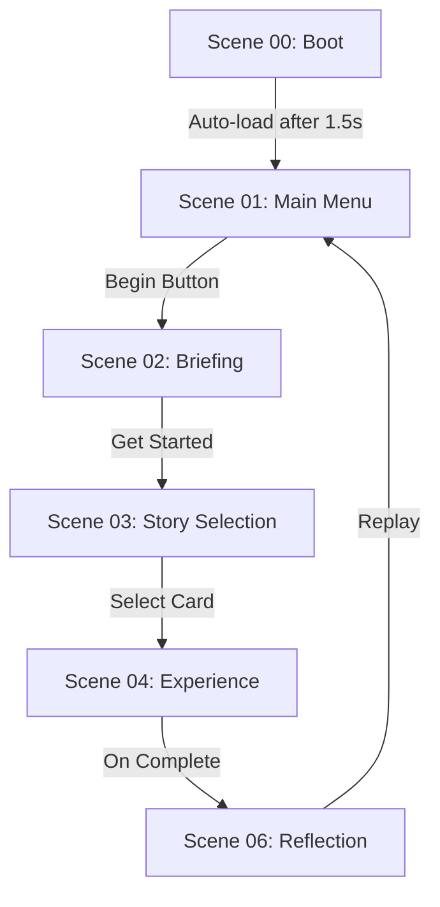

# EmpathyVR — Complete Scene Setup Guide
### Every Scene · Every GameObject · Every Script · Every UI Position · All Navigation

---

## How to Read This Guide

Each scene section tells you:
1. **What to create** — exact GameObjects and their names
2. **Which script goes on which GameObject** — copy the name exactly
3. **Inspector fields to fill** — what to drag where
4. **UI layout** — canvas size, anchor positions, pixel offsets
5. **How navigation works** — what loads next and when

**Canvas Rule (applies to ALL scenes):**
- Use **World Space** canvas for VR scenes
- Canvas size: **Width 1600, Height 900** (16:9)
- Position canvas: `X=0, Y=1.6, Z=2.0` relative to camera
- Scale: `X=0.001, Y=0.001, Z=0.001`
- All text: TextMeshPro minimum 28pt

---

## Scene Build Order

```
00_Boot  →  01_MainMenu  →  02_Briefing  →  03_StorySelection
         →  04_Experience_FarmersMorning
         →  05_Decision  (loaded additively or via SceneLoader)
         →  06_Reflection
```

Add all scenes to **File → Build Settings** in this order.

---

---

# SCENE 00 — Boot

**Purpose:** Spawns all DontDestroyOnLoad managers, shows logo for 1.5s, then loads MainMenu.
**No VR interaction needed. Simple splash screen.**

---

## Hierarchy

```
[Scene: 00_Boot]
│
├── [MANAGERS]
│   ├── GameObject: "ApplicationBootstrapper"
│   ├── GameObject: "GameManager"
│   ├── GameObject: "AudioManager"
│   └── GameObject: "SceneLoader"
│
├── [CAMERA]
│   └── GameObject: "Main Camera"
│
└── [UI]
    └── GameObject: "BootCanvas"
        ├── Image: "LogoBackground"
        ├── Image: "LogoIcon"
        ├── TextMeshPro: "AppTitle"
        ├── TextMeshPro: "Tagline"
        └── TextMeshPro: "LoadingLabel"
```

---

## Step-by-Step Setup

### Step 1 — Create Manager GameObjects

1. Create empty GameObject → name it `ApplicationBootstrapper`
   - **Add Script:** `ApplicationBootstrapper.cs`
   - **Inspector fields:**
     - `Game Manager Prefab` → drag your GameManager prefab
     - `Audio Manager Prefab` → drag your AudioManager prefab
     - `Scene Loader Prefab` → drag your SceneLoader prefab
     - `First Scene Name` → type `01_MainMenu`
     - `Minimum Splash Time` → `1.5`

2. Create empty GameObject → name it `GameManager`
   - **Add Script:** `GameManager.cs`
   - Leave inspector fields empty for now (Bootstrapper spawns it if missing)

3. Create empty GameObject → name it `AudioManager`
   - **Add Script:** `AudioManager.cs`
   - **Add Components:** AudioSource × 3
     - First AudioSource → rename child to `BGM_Source`
     - Second → `Ambient_Source`
     - Third → `SFX_Source`
   - **Inspector fields:**
     - Drag each AudioSource into `Bgm Source`, `Ambient Source`, `Sfx Source`

4. Create empty GameObject → name it `SceneLoader`
   - **Add Script:** `SceneLoader.cs`
   - **Inspector fields:**
     - `Fade Overlay` → drag the CanvasGroup from BootCanvas (see below)
     - `Fade Duration` → `1.2`

---

### Step 2 — Boot Canvas (Screen Space — this scene only uses Screen Space)

1. Create **UI → Canvas**
   - Name: `BootCanvas`
   - **Canvas component:** Render Mode = `Screen Space - Overlay`
   - Add **CanvasGroup** component to BootCanvas → this is your fade overlay

---

### Step 3 — Navigation

`ApplicationBootstrapper` handles this automatically:
- Waits `minimumSplashTime` seconds
- Calls `SceneLoader.Instance.LoadScene("01_MainMenu")`

---
---

# SCENE 01 — Main Menu

**Purpose:** The EmpathyVR splash/loading screen. Matches Image 5 in mockups.
Has a brief "INITIALIZING HUD" animation then a Start button.

---

## Hierarchy

```
[Scene: 01_MainMenu]
│
├── [MANAGERS] ← reference only, spawned by 00_Boot
│
├── [CAMERA]
│   └── GameObject: "Main Camera"
│
└── [UI]
    └── GameObject: "MainMenuCanvas"   ← Screen Space Overlay
        ├── Image: "Background"
        ├── Image: "VignetteOverlay"
        ├── Image: "LogoIcon"
        ├── TextMeshPro: "AppTitle"
        ├── TextMeshPro: "Tagline"
        ├── GameObject: "LoadingSpinner"
        │     └── Image: "SpinnerArc"
        ├── TextMeshPro: "InitLabel"
        ├── Button: "StartButton"     ← appears after 2s
        └── Panel: "BiometricBar"
              ├── Image: "PulseDot"
              └── TextMeshPro: "BiometricLabel"
```

---

## Step-by-Step Setup

### Step 1 — Canvas

Create **UI → Canvas**
- Name: `MainMenuCanvas`
- Render Mode: `Screen Space - Overlay`
- Add **CanvasGroup** component

### Step 2 — UI Logic

Attach `MainMenuController.cs` to `MainMenuCanvas`:
- `Loading Spinner` → drag LoadingSpinner GO
- `Init Label` → drag InitLabel
- `Start Button` → drag StartButton
- `Canvas Group` → drag CanvasGroup on MainMenuCanvas

---
---

# SCENE 02 — Briefing

**Purpose:** Shows the selected scenario's info card. Three sidebar tabs.
Matches Image 1 in mockups.

---

## Hierarchy

```
[Scene: 02_Briefing]
│
├── [CAMERA]
│   └── GameObject: "Main Camera"
│
└── [UI]
    └── GameObject: "BriefingCanvas"   ← Screen Space Overlay
        ├── Image: "Background"
        ├── Panel: "LeftSidebar"
        ├── Panel: "TopRight"
        ├── Panel: "CenterCard"
        └── Panel: "BottomProgressDots"
```

---

## Step-by-Step Setup

### Step 1 — Briefing UI

Attach `BriefingUI.cs` to `BriefingCanvas`:
- `Begin Experience Button` onClick → `SceneLoader.Instance.LoadScene("03_StorySelection")`

---
---

# SCENE 03 — Story Selection

**Purpose:** Three story cards. Player picks one. Matches Image 2 in mockups.

---

## Hierarchy

```
[Scene: 03_StorySelection]
│
├── [CAMERA]
│
└── [UI]
    └── Canvas: "StorySelectionCanvas"
        ├── Image: "Background"
        ├── Panel: "LeftSidebar"
        ├── Panel: "CenterSection"
        │     └── Panel: "CardContainer"   ← 3 cards spawn here
        └── Panel: "BottomBar"
```

---

## Step-by-Step Setup

### Step 1 — Story Selection UI

Attach `StorySelectionUI.cs` to `StorySelectionCanvas`:
- `Available Scenarios` → drag your 3 SO_Scenario assets
- `Story Card Prefab` → drag StoryCard prefab
- `Card Container` → drag CardContainer panel

---
---

# SCENE 04 — Experience: Farmer's Morning

**Purpose:** The main VR immersive scene. Narration plays, player walks waypoints, gazes at objects, and triggers decisions. Matches Image 3.

---

## Hierarchy

```
[Scene: 04_Experience_FarmersMorning]
│
├── [SYSTEMS]
│   ├── "NarrativeEngine"
│   ├── "DecisionManager"
│   └── "EnvironmentManager"
│
├── [PLAYER]
│   └── "XR_Rig"
│       ├── "Camera Offset"
│       │    └── "Main Camera"
│       │         └── "GazeReticle"
│
├── [UI — World Space Canvases]
│   ├── "HUD_Canvas"
│   ├── "DecisionPanel"
│   └── "ConsequencePanel"
│
├── [ENVIRONMENT]
│   ├── "ChapterEnvRoots"
│   ├── "DecisionTriggers_Root"
│   └── "Waypoints_Root"
```

---

## Step-by-Step Setup

### Step 1 — HUD & Feedback

1. **HUD_Canvas**: World Space (1600x900). Use `WorldCanvasFollower.cs` to keep it near the player.
2. **GazeReticle**: Small canvas on Camera with `GazeReticleUI.cs` to show dwell progress.

---
---

# SCENE 06 — Reflection

**Purpose:** Summary of all choices made. Reflection prompt. Replay option. Matches Image 4.

---

## Hierarchy

```
[Scene: 06_Reflection]
│
├── [CAMERA]
│
└── [UI]
    └── Canvas: "ReflectionCanvas"
        ├── Panel: "LeftSidebar"
        ├── TextMeshPro: "HeadlineText"
        ├── ScrollRect: "SummaryScroll"
        │     └── Content: "SummaryContainer"
        └── Panel: "ButtonRow"
```

---

## Complete Navigation Flow


